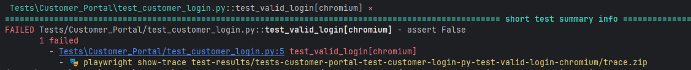

Release type: minor

Add Playwright trace file detection and display support for failed tests. This enhancement automatically detects and displays Playwright trace.zip files with viewing commands when tests fail, making debugging easier for Playwright users.

New command-line options:
- `--sugar-trace-dir`: Configure the directory name for Playwright trace files (default: test-results)
- `--sugar-no-trace`: Disable Playwright trace file detection and display
